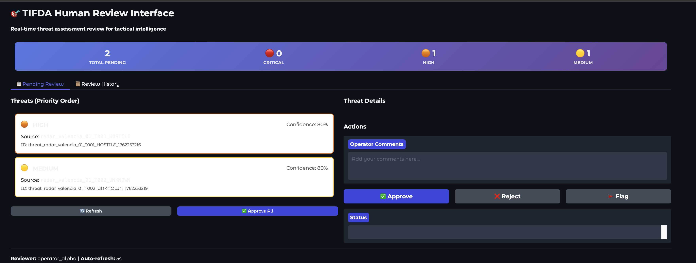
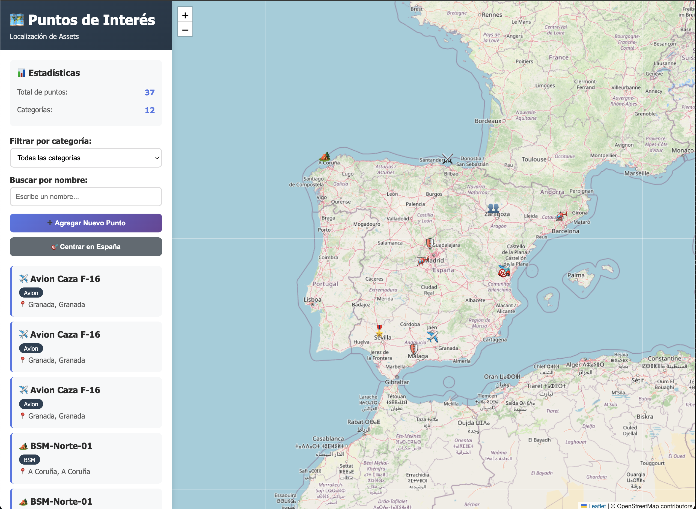

#  GenAI-Enabled Tactical Information Fusion and Dissemination Agent (TIFDA)

The TIFDA (Tactical Information Fusion and Dissemination Agent) is a GenAI agent-based tool that functions as a processing and distribution center for tactical information in a combat environment.

Its main functions are:

1. Ingest multimodal data from diverse sources.

2. Convert this data into a valid format to be used as Common Operational Picture (COP) by the Battle Management System (BMS). Note that this is not a real COP but a toy-model one. The COP is synchronised the one of an external service for mapping actors, [mapa-puntos-interes](https://github.com/MartinezAgullo/mapa-puntos-interes).

3. Selectively distribute only the essential information to the relevant output actors, utilizing their specific formats. 

* * * * *

## ⚙️ Technical Details

| Feature | Technology |
|---------|------------|
| **Framework** | LangGraph (multi-agent orchestration) |
| **LLM** | OpenAI GPT-4o / Anthropic Claude |
| **Integration** | MQTT broker, PostgreSQL + PostGIS, Gradio UI |
| **Parsers** | ASTERIX, drone telemetry, radio intercepts, manual reports |
| **Security** | Prompt injection detection, access control, honeypots |
| **Visualization** | [mapa-puntos-interes](https://github.com/MartinezAgullo/mapa-puntos-interes) (Leaflet map) |
| **Dependencies** | Managed with UV |


* * * * *
## 🚀 Quick Start

### Installation
```bash
# Clone repository
git clone https://github.com/MartinezAgullo/genai-tifda.git
cd genai-tifda


# Install dependencies
uv sync

# Configure
touch .env
# Edit .env with your API keys
```

### Run TIFDA

#### Prerequisites
1. **Map visualization** - Download [mapa-puntos-interes](https://github.com/MartinezAgullo/mapa-puntos-interes)
2. **PostgreSQL** - Required for map backend
3. **MQTT Broker** - Required for message dissemination

<!-- The first step is to run the interactive map for the COP. It can be dowlodad from [here](https://github.com/MartinezAgullo/mapa-puntos-interes). -->

#### Complete Startup Sequence

```bash
# Terminal 1: Start PostgreSQL & map visualization
cd <your-path-to-the-map-project>/mapa-puntos-interes
docker compose up -d        # Start PostgreSQL
node scripts/init-db.js     # Initialize database (first time only)
npm run dev                 # Start map server → http://localhost:3000


# Terminal 2: Start MQTT broker
cd <tifda-project>
mosquitto -c mqtt/config/mosquitto.conf


# Terminal 3: Subscribe to MQTT messages (optional - to see outputs)
mosquitto_sub -t 'tifda/output/#' -v
# mosquitto_sub -t 'tifda/output/dissemination_reports/#' -v


# Terminal 4: Start HITL UI (optional - for human review)
uv run python -m src.ui.gradio_interface    # UI → http://localhost:7860


# Terminal 5: Run TIFDA pipeline
uv run python -m tests.test_ui_hilt_radar   # Send test radar data
```
A mocked radar signal message is sent with test_ui_hilt_radar.py to start the TIFDA pipeline. 





## ⚙️ Configuration

Edit `src/core/init_config.py` to customize:

- **LLM settings**: Model, temperature, provider
- **HITL mode**: Enable/disable human review, timeout
- **Integrations**: MQTT broker, mapa sync, ports
- **Security**: Access levels, classification rules

Example:
```python
config.llm.model = "gpt-4o"
config.enable_human_review = True
config.auto_approve_timeout_seconds = 300
```


* * * * *

## 📂 Project Scaffolding
----------------------

```bash
tifda/
.
├── config
│   ├── recipients.yaml         # Entities to be notified of threads
│   └── threat_thresholds.yaml  # Distance thresholds to rule-based decisions
├── data
│   └── shared_state.json       # HITL state persistence
├── mqtt
│   ├── config
│   │   └── mosquitto.conf      # MQTT broker config
│   ├── data
│   └── log
├── output
│   ├── dissemination_reports   # Generated reports
│   └── threat_assessments      # Generated analysis
├── pyproject.toml
├── src
│   ├── core
│   │   ├── config.py           # Configuration schema
│   │   ├── constants.py
│   │   ├── init_config.py      # User configuration
│   │   └── state.py            # LangGraph state
│   ├── integrations            # External services
│   │   ├── cop_sync.py
│   │   ├── mapa_client.py
│   │   ├── mqtt_client.py
│   │   └── mqtt_publisher.py
│   ├── models                  # Data models
│   │   ├── cop_entities.py
│   │   ├── dissemination.py
│   │   ├── human_feedback.py
│   │   └── sensor_formats.py
│   ├── nodes                   # Pipeline nodes
│   │   ├── cop_merge_node.py
│   │   ├── cop_normalizer_node.py
│   │   ├── cop_update_node.py
│   │   ├── dissemination_router_node.py
│   │   ├── firewall_node.py
│   │   ├── format_adapter_node.py
│   │   ├── human_review_node.py
│   │   ├── multimodal_parser_node.py
│   │   ├── parser_node.py
│   │   ├── threat_evaluator_node.py
│   │   └── transmission_node.py
│   ├── parsers                 # Format handlers
│   │   ├── asterix_parser.py
│   │   ├── base_parser.py
│   │   ├── drone_parser.py
│   │   ├── manual_parser.py
│   │   ├── parser_factory.py
│   │   └── radio_parser.py
│   ├── rules                       # Deterministic rule engine
│   │   ├── threat_rules.py         # Is the threat dangerous?
│   │   ├── dissemination_rules.py  # Who should we tell?
│   │   └── classification_rules.py # Do the receivers have the clearance?
│   ├── security
│   │   ├── REAMDE.md
│   │   └── firewall.py         # Injection detection
│   ├── tifda_app.py            # Main pipeline
│   ├── tools                   # Multimodal processings
│   │   ├── audio_tools.py
│   │   ├── document_tools.py
│   │   └── image_tools.py
│   └── ui
│       ├── gradio_interface.py
│       └── review_service.py   # State management
└── tests                       # Test different steps of the pipeline
    ├── diagnostic_approved_threats.py
    ├── test_flux.py
    ├── test_human_review.py
    ├── test_integrations.py
    ├── test_mapa_sync.py
    ├── test_mqtt_flux.py
    ├── test_mqtt_integration.py
    ├── test_parsers.py
    ├── test_pipeline_visualization.py
    ├── test_radar.py
    ├── test_ui_hilt_radar.py   # HITL integration
    └── test_phase5_dissemination.py # Comprhensive test
```


* * * * *

## 🏗️ System Architecture
----------------------

```
╔═══════════════════════════════════════════════════════════════════════════════╗
║                            TIFDA ARCHITECTURE                                 ║
║                Tactical Information Fusion & Dissemination Agent              ║
╚═══════════════════════════════════════════════════════════════════════════════╝

┌─────────────────────────────────────────────────────────────────────────────┐
│                          1. INPUT LAYER (Sensors)                           │
└─────────────────────────────────────────────────────────────────────────────┘
           │
           │  SensorMessage (MQTT Topics)
           │
    ┌──────┼──────┬──────-─┬────────┬
    │      │      │        │        │
┌───▼──┐ ┌─▼───┐ ┌▼────┐  ┌▼─────┐ ┌▼──────┐
│Radar │ │Drone│ │Radio│  │Manual│ │Other  │
│      │ │ UAV │ │COMINT│ │SITREP│ │Sensors│
└──┬───┘ └──┬──┘ └──┬──┘  └──┬───┘ └───┬───┘
   │        │       │        │         │
   └────────┴───────┴──────-─┴─────────┘
                    │
                    │ JSON/Binary Data
                    ▼
┌─────────────────────────────────────────────────────────────────────────────┐
│                    2. SECURITY LAYER (Firewall)                             │
│                                                                             │
│  ┌──────────────────────────────────────────────────────────────────┐       │
│  │ • Sensor Authorization (Whitelist)                               │       │
│  │ • Prompt Injection Detection                                     │       │
│  │ • Coordinate Validation                                          │       │
│  │ • Classification Level Validation                                │       │
│  │ • Access Control Enforcement                                     │       │
│  └──────────────────────────────────────────────────────────────────┘       │
└─────────────────────────────────────────────────────────────────────────────┘
                    │
                    │ Validated SensorMessage
                    ▼
┌───────────────────────────────────────────────────────────────────────────-──┐
│                    3. PARSING LAYER (Format Handlers)                        │
│                                                                              │
│  ┌──────────────┐  ┌──────────────┐  ┌──────────────┐  ┌──────────────┐      │
│  │   ASTERIX    │  │    Drone     │  │    Radio     │  │   Manual     │      │
│  │   Parser     │  │   Parser     │  │   Parser     │  │   Parser     │      │
│  └──────┬───────┘  └──────┬───────┘  └──────┬───────┘  └──────┬───────┘      │
│         │                 │                 │                 │              │
│         └─────────────────┴─────────────────┴─────────────────┘              │
│                                    │                                         │
│                         ┌──────────▼──────────┐                              │
│                         │  ParserFactory      │                              │
│                         │  (Auto-selection)   │                              │
│                         └──────────┬──────────┘                              │
└────────────────────────────────────┼─────────────────────────────────────────┘
                                     │
                                     │ List[EntityCOP]
                                     ▼
┌─────────────────────────────────────────────────────────────────────────────┐
│              4. MULTIMODAL PROCESSING (LLM Tools)                           │
│                                                                             │
│  ┌────────────────────────────────────────────────────────────────┐         │
│  │  Audio Transcription (Whisper + pyannote)                      │         │
│  │  • Radio intercepts → Text                                     │         │
│  │  • Voice reports → Structured data                             │         │
│  └────────────────────────────────────────────────────────────────┘         │
│                                                                             │
│  ┌────────────────────────────────────────────────────────────────┐         │
│  │  Image Analysis (GPT-4V / Claude Vision)                       │         │
│  │  • Drone imagery → Entity detection                            │         │
│  │  • Visual intel → Threat identification                        │         │
│  └────────────────────────────────────────────────────────────────┘         │
│                                                                             │
│  ┌────────────────────────────────────────────────────────────────┐         │
│  │  Text Extraction (NLP)                                         │         │
│  │  • Manual reports → Structured entities                        │         │
│  │  • Free-form text → Geographic coordinates                     │         │
│  └────────────────────────────────────────────────────────────────┘         │
└─────────────────────────────────────────────────────────────────────────────┘
                                     │
                                     │ Enhanced List[EntityCOP]
                                     ▼
┌─────────────────────────────────────────────────────────────────────────────┐
│                  5. COP NORMALIZATION & MERGE                               │
│                                                                             │
│  ┌────────────────────────────────────────────────────────────────┐         │
│  │  COP Normalizer (LLM Agent)                                    │         │
│  │  • Standardize entity formats                                  │         │
│  │  • Resolve coordinate systems                                  │         │
│  │  • Validate entity types                                       │         │
│  │  • Assign information_classification                           │         │
│  └────────────────┬───────────────────────────────────────────────┘         │
│                   │                                                         │
│                   ▼                                                         │
│  ┌────────────────────────────────────────────────────────────────┐         │
│  │  COP Merge Logic                                               │         │
│  │  • Deduplicate entities (same track from multiple sensors)     │         │
│  │  • Fuse sensor data (Kalman filter, weighted average)          │         │
│  │  • Update confidence based on multi-sensor correlation         │         │
│  │  • Track history and velocity vectors                          │         │
│  └────────────────-┬──────────────────────────────────────────────┘         │
└────────────────────┼────────────────────────────────────────────────────────┘
                     │
                     │ Merged EntityCOP
                     ▼
┌─────────────────────────────────────────────────────────────────────────────┐
│              6. COP STATE (In-Memory - Heart of TIFDA)                      │
│                                                                             │
│  ╔═══════════════════════════════════════════════════════════════╗          │
│  ║          cop_entities: Dict[str, EntityCOP]                   ║          │
│  ║                                                               ║          │
│  ║  {                                                            ║          │
│  ║    "radar_01_T001": EntityCOP(...),                           ║          │
│  ║    "drone_alpha_obj_05": EntityCOP(...),                      ║          │
│  ║    "manual_charlie_report": EntityCOP(...)                    ║          │
│  ║  }                                                            ║          │
│  ╚═══════════════════════════════════════════════════════════════╝          │
│                                                                             │
│  • Real-time updates from sensors                                           │
│  • Fast in-memory access for threat evaluation                              │
│  • No I/O blocking during processing                                        │
│  • Synchronizes to PostgreSQL (mapa-puntos-interes) asynchronously          │
└─────────────────────────────────────────────────────────────────────────────┘
                     │
                     │ COP State
                     ▼
┌─────────────────────────────────────────────────────────────┐
│  7. THREAT EVALUATION (Hybrid: Rules + LLM)                 │
│                                                             │
│  ┌────────────────────────────────────────────────────┐     │
│  │  Step 1: Quick Filter (threat_rules.py)            │     │
│  │  • IF friendly → Skip (no threat)                  │     │
│  │  • IF hostile/unknown → Continue to assessment     │     │
│  └────────────────────────────────────────────────────┘     │
│                          ↓                                  │
│  ┌────────────────────────────────────────────────────┐     │
│  │  Step 2: Rule-Based Assessment                     │     │
│  │                                                    │     │
│  │  IF hostile missile + distance < 50km:             │     │
│  │     → CRITICAL (no LLM, <100ms)                    │     │
│  │                                                    │     │
│  │  IF friendly entity:                               │     │
│  │     → NONE (no LLM, <100ms)                        │     │
│  │                                                    │     │
│  │  Config: threat_thresholds.yaml                    │     │
│  └────────────────┬───────────────────────────────────┘     │
│                   │                                         │
│                   ├─ Obvious? → Fast decision               │
│                   │                                         │
│                   └─ Ambiguous? ↓                           │
│  ┌────────────────────────────────────────────────────┐     │
│  │  Step 3: LLM Assessment                            │     │
│  │  (Only ambiguous scenarios)                        │     │
│  │  • Context: entity + nearby friendlies + history   │     │
│  │  • Model: GPT-4o                                   │     │
│  │  • Output: threat_level + confidence + reasoning   │     │
│  │  • Latency: 2-5s, Cost: ~$0.02                     │     │
│  └────────────────────────────────────────────────────┘     │
│                                                             │
│  Output: List[ThreatAssessment]                             │
└─────────────────────────────────────────────────────────────┘
                     │
                     │ List[ThreatAssessment]
                     ▼
┌─────────────────────────────────────────────────────────────────────────────┐
│                  8. HUMAN-IN-THE-LOOP (HITL) REVIEW                         │
│                                                                             │
│  ┌────────────────────────────────────────────────────────────────┐         │
│  │  Review Triggers:                                              │         │
│  │  • Critical threats (requires_human_review = True)             │         │
│  │  • TOP_SECRET dissemination                                    │         │
│  │  • Low confidence (<0.6)                                       │         │
│  │  • First contact with entity/sensor type                       │         │
│  │  • Conflicting sensor reports                                  │         │
│  │  • Enemy access transmission (deception ops)                   │         │
│  └────────────────┬───────────────────────────────────────────────┘         │
│                   │                                                         │
│                   ▼                                                         │
│  ┌────────────────────────────────────────────────────────────────┐         │
│  │  Human Operator Actions:                                       │         │
│  │  • HILT                                                        │         │
│  │  • Approve / Reject / Modify threat assessment                 │         │
│  │  • Approve / Reject dissemination decisions                    │         │
│  │  • Provide feedback for model learning                         │         │
│  │  • Override classification or confidence                       │         │
│  └────────────────┬───────────────────────────────────────────────┘         │
└────────────────────┼────────────────────────────────────────────────────────┘
                     │
                     │ Approved Threats + Feedback
                     ▼
┌─────────────────────────────────────────────────────────────┐
│  9. DISSEMINATION ROUTER (Rule-Based + LLM Fallback)        │
│                                                             │
│  Config Files:                                              │
│  • recipients.yaml (who can receive what)                   │
│  • threat_thresholds.yaml (distance rules)                  │
│                                                             │
│  ┌────────────────────────────────────────────────────┐     │
│  │  Filter 1: Classification Control                  │     │
│  │  (classification_rules.py)                         │     │
│  │                                                    │     │
│  │  Check: recipient.access_level vs entity.classification│ │
│  │                                                    │     │
│  │  IF recipient = SECRET & entity = TOP_SECRET:      │     │
│  │     → Auto-downgrade (round coords, hide sensors)  │     │
│  │                                                    │     │
│  │  IF recipient = CONFIDENTIAL & entity = SECRET:    │     │
│  │     → BLOCK (insufficient clearance)               │     │
│  └────────────────────────────────────────────────────┘     │
│                          ↓                                  │
│  ┌────────────────────────────────────────────────────┐     │
│  │  Filter 2: Distance-Based Need-to-Know             │     │
│  │  (dissemination_rules.py)                          │     │
│  │                                                    │     │
│  │  Calculate: Haversine distance (threat ↔ recipient)│     │
│  │                                                    │     │
│  │  IF distance < must_notify_km:                     │     │
│  │     → SEND (rule-based, mandatory)                 │     │
│  │                                                    │     │
│  │  IF distance > never_notify_km:                    │     │
│  │     → BLOCK (rule-based, too far)                  │     │
│  │                                                    │     │
│  │  IF in between (ambiguous zone):                   │     │
│  │     → Ask LLM (consider speed, heading, urgency)   │     │
│  │                                                    │     │
│  │  Example thresholds (hostile aircraft):            │     │
│  │  • must_notify: 300km                              │     │
│  │  • never_notify: 600km                             │     │
│  │  • ambiguous: 300-600km                            │     │
│  └────────────────────────────────────────────────────┘     │
│                          ↓                                  │
│  ┌────────────────────────────────────────────────────┐     │
│  │  Filter 3: Operational Role Matching               │     │
│  │  (dissemination_rules.py)                          │     │
│  │                                                    │     │
│  │  Match entity_type to recipient.priority_types:    │     │
│  │                                                    │     │
│  │  • Air defense ← ["aircraft", "missile", "uav"]    │     │
│  │  • Ground ops ← ["tank", "infantry", "artillery"]  │     │
│  │  • Naval ops ← ["ship", "submarine"]               │     │
│  │  • Command ← ["all"] (everything)                  │     │
│  └────────────────────────────────────────────────────┘     │
│                          ↓                                  │
│  ┌────────────────────────────────────────────────────┐     │
│  │  🚨 Emergency Override Check                       │     │
│  │                                                    │     │
│  │  IF emergency_override = True:                     │     │
│  │     → Bypass ALL filters                           │     │
│  │     → Send to ALL recipients                       │     │
│  │     → "Red Button" for critical situations         │     │
│  └────────────────────────────────────────────────────┘     │
│                                                             │
│  Output: List[OutgoingMessage] (targeted, not broadcast)    │
│          • 75% fewer messages than broadcast                │
│          • Only need-to-know recipients                     │
└─────────────────────────────────────────────────────────────┘
                     │
                     │ List[DisseminationDecision]
                     ▼
┌───────────────────────────────────────────────────────────────────────────┐
│                  10. FORMAT ADAPTERS                                      │
│                                                                           │
│  Convert EntityCOP → Recipient-specific format:                           │
│                                                                           │
│  ┌─────────────┐  ┌─────────────┐  ┌─────────────┐  ┌─────────────┐       │
│  │   Link-16   │  │    JSON     │  │  ASTERIX    │  │     CoT     │       │
│  │   Adapter   │  │   Adapter   │  │   Adapter   │  │   Adapter   │       │
│  └──────┬──────┘  └──────┬──────┘  └──────┬──────┘  └──────┬──────┘       │
│         │                │                │                │              │
│  ┌──────▼────────┐  ┌────▼──────────┐  ┌─-▼───────────┐   ┌▼───────────┐  │
│  │ Voice/Text    │  │  Custom       │  │    ...       │   │  mapa-     │  │
│  │ Adapter       │  │  Adapter      │  │              │   │  puntos    │  │
│  └───────────────┘  └───────────────┘  └──────────────┘   └────┬───────┘  │
│                                                                │          │
│  Output: OutgoingMessage with formatted content                │          │
└────────────────────────────────────────────────────────────────┼──────────┘
                                                                 │
                                                                 ▼
┌─────────────────────────────────────────────────────────────────────────────┐
│                  11. TRANSMISSION LAYER                                     │
│                                                                             │
│  ┌────────────────────────────────────────────────────────────────┐         │
│  │  Transmission Methods:                                         │         │
│  │                                                                │         │
│  │  • MQTT Publisher (primary)                                    │         │
│  │    - Publish to recipient-specific topics                      │         │
│  │    - QoS based on message criticality                          │         │
│  │                                                                │         │
│  │  • HTTP/REST API (secondary)                                   │         │
│  │    - POST to recipient endpoints                               │         │
│  │    - Retry logic with exponential backoff                      │         │
│  │                                                                │         │
│  │  • Radio/Voice (tactical comms)                                │         │
│  │    - Text-to-speech for voice networks                         │         │
│  │    - Pre-formatted tactical brevity                            │         │
│  └────────────────┬───────────────────────────────────────────────┘         │
└────────────────────┼────────────────────────────────────────────────────────┘
                     │
                     ▼
┌─────────────────────────────────────────────────────────────────────────────┐
│                  12. AUDIT & LOGGING                                        │
│                                                                             │
│  ┌────────────────────────────────────────────────────────────────┐         │
│  │  Comprehensive Audit Trail:                                    │         │
│  │                                                                │         │
│  │  • All sensor inputs (who, what, when, where)                  │         │
│  │  • Firewall decisions (blocked/allowed)                        │         │
│  │  • Entity merges and updates                                   │         │
│  │  • Threat assessments and reasoning                            │         │
│  │  • Human review decisions and feedback                         │         │
│  │  • Dissemination decisions and justifications                  │         │
│  │  • All transmissions (recipient, content, timestamp)           │         │
│  │  • Classification violations (attempted/blocked)               │         │
│  │  • Deception operations (enemy_access)                         │         │
│  │                                                                │         │
│  │  Stored in: data/audit_logs/ (append-only)                     │         │
│  └────────────────────────────────────────────────────────────────┘         │
└─────────────────────────────────────────────────────────────────────────────┘
                     │
                     ▼
┌───────────────────────────────────────────────────────────────────────────┐
│                  13. OUTPUT SYSTEMS (Recipients)                          │
│                                                                           │
│  ┌──────────────┐  ┌──────────────┐  ┌──────────────┐  ┌──────────────┐   │
│  │  Allied BMS  │  │   Tactical   │  │   Command    │  │   Friendly   │   │
│  │   (NATO)     │  │    Radio     │  │     Post     │  │   Aircraft   │   │
│  └──────────────┘  └──────────────┘  └──────────────┘  └──────────────┘   │
│                                                                           │
│  ┌──────────────┐  ┌──────────────┐  ┌──────────────┐                     │
│  │ mapa-puntos- │  │   Enemy      │  │   Archive    │                     │
│  │   interes    │  │   Monitor    │  │   System     │                     │
│  │  (Visual COP)│  │  (Deception) │  │              │                     │
│  └──────────────┘  └──────────────┘  └──────────────┘                     │
└───────────────────────────────────────────────────────────────────────────┘
```

* * * * *

## Integration with COP Visualization Tool
----------------------

This project integrates the [mapa-puntos-interes](https://github.com/MartinezAgullo/mapa-puntos-interes) tool.

<!-- cd /Users/pablo/Desktop/Scripts/mapa-puntos-interes -->
```bash
cd mapa-puntos-interes
docker compose up -d
node scripts/init-db.js
npm run dev
```
<!--  -->


TIFDA automatically syncs entities via `cop_sync.py`.


```
┌─────────────────────────────────────────────────────────┐
│                        TIFDA                            │
│                                                         │
│  ┌────────────┐    ┌──────────────┐   ┌──────────────┐  │
│  │  Parsers   │ -> │ EntityCOP    │ ->│  COP State   │  │
│  └────────────┘    └──────────────┘   └──────┬───────┘  │
│                                              │          │
│                    ┌─────────────────────────┘          │
│                    │                                    │
│              ┌─────▼──────┐                             │
│              │ COP Sync   │                             │
│              │ (Monitor)  │                             │
│              └─────┬──────┘                             │
│                    │                                    │
│              ┌─────▼──────┐                             │
│              │Mapa Client │                             │
│              └─────┬──────┘                             │
└────────────────────┼────────────────────────────────────┘
                     │ HTTP POST/PUT/DELETE
                     │
┌────────────────────▼────────────────────────────────────┐
│              mapa-puntos-interes                        │
│                                                         │
│  ┌──────────────┐    ┌──────────────┐                   │
│  │  Express API │ -> │ PostgreSQL   │                   │
│  │  /api/puntos │    │  + PostGIS   │                   │
│  └──────────────┘    └──────────────┘                   │
│                                                         │
│  ┌──────────────────────────────────┐                   │
│  │      Leaflet Map Viewer          │                   │
│  └──────────────────────────────────┘                   │
└─────────────────────────────────────────────────────────┘
```

---

## 📄 Licencia

GNU General Public License (GPL) 3.0


<!-- 
tree -I "__pycache__|__init__.py|uv.lock|visualization|README.md|tests|assets|*.log|*.db*|*.png|*.PNG" 
-->